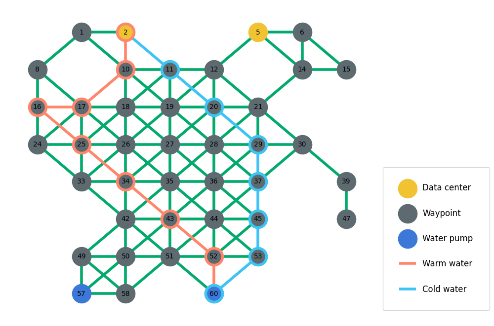

# Programming assignment for software developer positions at Sanako Oy

> Application period: 2022-04-06 to 2022-05-06.

The purpose of this assignment is to demonstrate your programming skills.

Please include your CV (.pdf or .md) to your submission, unless you have already sent us an up-to-date version of your CV.

We will review your submission, and if we like it, we'll invite you to an interview.

This is a generic assignment for both backend and frontend developer roles.

You may use one of the following programming languages to implement your solution: `TypeScript`, `JavaScript`, `Python`, or `C#`.

Your solution may only use libraries and functionality from the language standard library. External packages cannot be used at this time. However, you may use other libraries for utility functions such as testing or visualization.

This assignment should be completed in approximately 1-2 hours. You may spent more or less time on this assignment.

We politely ask you not to publish your solution on the Internet or to share with anyone during the application period.

This assignment might not fully represent the work you would do at Sanako. 

We also have another web development related task, that you'll need to do. The details for the second assignment are sent to you, if you are selected to proceed after the first interview. The second assignment should be completed 3-6 hours.

## Submission

Add your solution to a Zip archive, and send it to hiring+`submission` at sanako.fi, where `submission` is any random 6-8 digit number.

Remember to add all necessary files to your submission. Please, also include instructions on how to run your solution.

You may also include your CV to the submission Zip archive. Allowed file formats are PDF and Markdown (.md).

## Evaluation

We evaluate your solution with the following criteria, in order of priority:
- How well the application is structured (readability, architecture, documentation, clean code, etc...)
- Does the application produce a correct solution
- How efficient is the implementation

## Assignment specifications

> This is an fictious and stylized problem description.

The data center uses the water for cooling, by pumping cold water to the cooling towers and then pushing the warm water back into the water reservoir.

Your task is to find the shortest path for water pipes from the data center to a nearby pump at a water reservoir and back again.

The paths must not have any shared nodes, except for the starting and ending points.

This task can be split into two subproblems, where you’ll first find the shortest path from the data center to any of the water pumps, after that you’ll find another shortest path back from the water pump to the data center.

Each edge (the connection between two nodes) has an attribute called "cost" which represents the net cost for installing the pipe between the two nodes. Your solution must minimize the cost of installing the pipes.

In the visualization below, we can observe that there are a number of different nodes for the data center, these could be considered as different locations around the site where the pipes can be attached to.



### Input

Assignment input can be found from ([`graph-1.json`](./graph-1.json)).

Here is a snippet from the example input ([`graph-0.json`](./graph-0.json)):

```jsonc
{
  "nodes": [
    {
      "id": 1, // Node ID
      "x": 1,
      "y": 0,
      "kind": "waypoint", // One of: datacenter, waypoint, water_pump
      "edges": [
        {
          "node_id": 2,
          "cost": 54.8488
        },
        {
          "node_id": 8,
          "cost": 28.4144
        },
        {
          "node_id": 10,
          "cost": 19.4081
        }
      ]
    },
    // ...
  ]
}
```


### Output

Our implementation may produce the solution output either to
- a .json file
- stardard output (stdout)

Example solution output (JSON):
```jsonc
{
    "warm_water_pipe": [2,10,17,16,25,34,43,52,60],
    "cold_water_pipe": [60,53,45,37,29,20,11,2],
    "total_cost": 388.357,
}
```